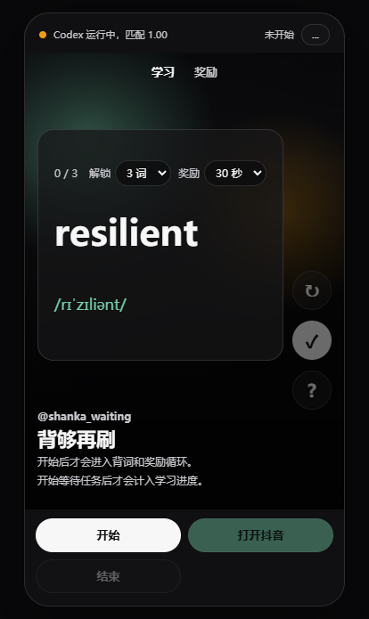
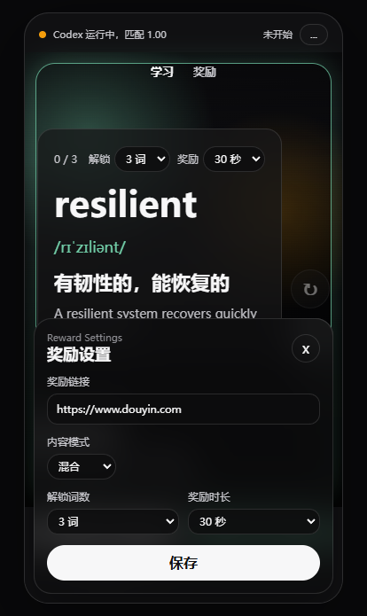

<div align="center">

# Interlude Deck

> 把 AI 等待时间变成一小段学习、整理和奖励循环。

**一个面向 Windows Codex Desktop 的短视频式微学习伴侣。**
<br>
它会在 AI Agent 工作时自动出现，帮你完成几张轻量卡片，解锁限时奖励，并在 Codex 需要你回来时立刻隐退。
<br><br>

<a href="README.md">English</a> | <a href="README.zh-CN.md"><strong>简体中文</strong></a>
<br><br>

<a href="https://github.com/Iroha-P/Interlude-Deck">
  
</a>
<a href="LICENSE">
  
</a>


<a href="#功能特性">功能特性</a> ·
<a href="#截图">截图</a> ·
<a href="#界面说明">界面说明</a> ·
<a href="#工作原理">工作原理</a> ·
<a href="#使用方法">使用方法</a> ·
<a href="#项目结构">项目结构</a>

</div>

> **仅支持 Windows 的 MVP 版本。** Interlude Deck 是 Codex Desktop 的外挂式伴侣程序，不修改 Codex 内部逻辑，而是通过窗口检测和本地控制接口，在合适的时机显示或隐藏学习窗口。

---

## 为什么需要 Interlude Deck

AI 编程助手经常会制造 30 秒到 3 分钟的微型等待期。这段时间不够进入深度工作，却足够让人顺手打开短视频，然后一不小心滑很久。

Interlude Deck 想把这段空档变成可控的小间奏：

- 背几个单词或看几张技术卡片
- 完成指定数量后解锁短暂奖励
- Codex 完成任务后自动回到工作流

它不是那种很硬的效率工具，更像是对刷短视频冲动的温和替代：快、轻、反馈明确，也容易随时离开。

## 功能特性

- **感知 Codex 状态**：检测到 Codex 正在运行时显示，任务结束时隐藏
- **置顶手机窗口**：短视频式竖屏卡片流，轻量浮在 Codex 旁边
- **微学习卡片**：支持英语单词、技术卡片和混合模式
- **奖励门槛**：完成 N 张卡片后解锁奖励
- **抖音奖励模式**：默认打开 `https://www.douyin.com`，计时 15 / 30 / 60 秒后回到学习窗口
- **焦点回收**：Codex 完成或需要操作时，自动隐藏学习窗口并切回 Codex
- **主题桥接**：可接收 watcher 传入的浅色或深色主题提示
- **本地设置**：奖励链接、内容模式、解锁数量、奖励时长都会保存到本地
- **本地控制 API**：其他脚本可以控制开始、暂停、继续、结束、移动窗口和切换主题
- **首次模板捕获**：截取 Codex 的 Stop/loading 区域，用于判断 Codex 是否忙碌

## 截图

### 手机式卡片流



### 奖励解锁


### 设置面板



## 界面说明

Interlude Deck 被设计成一个贴在 Codex 旁边的小手机屏幕，所以它更像一个受控的信息流，而不是一个完整桌面应用。

### 卡片流状态

主界面一次只显示一张卡片。使用鼠标滚轮、`ArrowDown` 或 `j` 切换下一张；按 `Space` 或点击卡片可以翻面查看答案。

| 元素 | 说明 |
|------|------|
| 顶部状态栏 | 显示 Codex 连接状态、忙碌状态和检测分数 |
| 模式标签 | 单词、技术卡片或混合模式 |
| 解锁计数 | 显示还需要完成多少张卡片才能解锁奖励 |
| 卡片主体 | 显示问题和答案 |
| 右侧操作栏 | 翻面、通过、继续学习和奖励入口 |

### 奖励状态

完成设定数量的卡片后，奖励按钮会变为可用。默认奖励链接是 `https://www.douyin.com`，会在浏览器中打开一个限时奖励。

奖励计时结束后，Interlude Deck 会回到学习窗口。如果 Codex 提前完成，watcher 会隐藏 Interlude Deck 并把焦点切回 Codex。

### 设置状态

设置面板可以调整：

- 奖励链接
- 内容模式
- 解锁门槛：2、3 或 5 张卡片
- 奖励时长：15、30 或 60 秒

设置会保存在 Electron 用户数据目录中，重启后仍然生效。

## 工作原理

```text
Codex Desktop 窗口
        |
        | 截图模板匹配
        v
Python watcher
        |
        | localhost 控制桥
        v
Electron 置顶窗口
        |
        | 奖励 / 焦点 / 隐藏命令
        v
浏览器 + Codex 前台窗口
```

1. Python watcher 查找 Codex 窗口。
2. watcher 将首次捕获的 Stop/loading 模板与当前 Codex 截图进行匹配。
3. 模板出现时，Interlude Deck 收到 `/task/start` 并显示在 Codex 附近。
4. 模板消失时，Interlude Deck 收到 `/task/end`，窗口隐藏，并把 Codex 带回前台。
5. Electron 窗口负责卡片、设置、奖励计时和短视频式交互循环。

## 环境要求

- **Windows 10/11**
- **Node.js 18+**
- **Python 3.8+**
- **Codex Desktop**
- `requirements.txt` 中的 Python 依赖

## 使用方法

### 方式一：命令行快速启动

```powershell
git clone https://github.com/Iroha-P/Interlude-Deck.git
cd Interlude-Deck
npm install
python -m pip install -r requirements.txt
```

如果 Electron 下载较慢，可以使用镜像：

```powershell
$env:ELECTRON_MIRROR='https://npmmirror.com/mirrors/electron/'
npm install
```

### 方式二：Windows 脚本

按顺序双击：

```text
scripts/install.cmd
scripts/capture_codex_template.cmd
scripts/start_codex_mode.cmd
```

如果要检查本地环境，双击：

```text
scripts/doctor.cmd
```

## 首次设置

### 1. 捕获 Codex 忙碌模板

打开 Codex Desktop，启动一个任务，让 Stop/loading 指示区域可见。

然后运行：

```powershell
npm run capture:codex
```

框选一个稳定的 Stop/loading 区域，然后按 `Enter`。

如果没有框选区域，Interlude Deck 会保存整个 Codex 窗口作为兜底模板。小区域更准确，但全窗口兜底能帮助第一次配置先跑起来。

### 2. 启动 Codex 联动模式

```powershell
npm run codex:mode
```

这个命令会启动 Electron 窗口和 Codex watcher，并开始根据 Codex 忙碌状态自动显示或隐藏。

### 3. 检查健康状态

```powershell
npm run doctor
```

doctor 会检查 Python 模块、忙碌模板、Codex 窗口和 Electron 本地控制服务。

## 常用命令

```powershell
npm start              # 只启动 Electron 学习窗口
npm run capture:codex  # 捕获 Codex 忙碌/loading 模板
npm run codex:mode     # 启动 Electron + Codex watcher
npm run watch:codex    # 只启动 watcher
npm run doctor         # 检查本地环境
npm test               # 运行 JS 和 Python 测试
```

## 本地控制 API

Electron 监听 `127.0.0.1:39473`。

```powershell
curl -X POST http://127.0.0.1:39473/task/start
curl -X POST http://127.0.0.1:39473/task/pause
curl -X POST http://127.0.0.1:39473/task/resume
curl -X POST http://127.0.0.1:39473/task/end
```

Python 辅助命令：

```powershell
python scripts/task_control.py start
python scripts/task_control.py end
```

其他接口：

```text
GET  /health
POST /window/place
POST /theme
POST /detector/status
```

## 项目结构

```text
Interlude-Deck/
├─ data/
│  ├─ vocabulary.json              # 单词卡片数据
│  ├─ tech_cards.json              # 技术卡片数据
│  └─ detector/                    # 本地 Codex 忙碌模板
├─ docs/
│  ├─ images/                      # README 截图
│  ├─ MVP.md                       # MVP 交付说明
│  └─ USER_GUIDE.md                # 分步骤使用指南
├─ scripts/
│  ├─ capture_codex_template.py    # 首次捕获 Codex 模板
│  ├─ codex_watch.py               # Codex 窗口检测与控制
│  ├─ run_codex_mode.py            # Electron + watcher 启动器
│  ├─ doctor.py                    # 本地诊断
│  └─ task_control.py              # 手动控制辅助脚本
├─ src/
│  ├─ main.js                      # Electron 主进程和本地 API
│  ├─ preload.cjs                  # 安全的 renderer 桥接
│  ├─ renderer.js                  # UI 交互
│  ├─ styles.css                   # 手机卡片流视觉样式
│  └─ *.test.js                    # Node 测试
└─ tests/
   └─ test_codex_watch.py          # Python watcher 测试
```

## 常见问题

### 模板捕获窗口提示 "No crop selected"

重新运行捕获命令，并在 Codex 的 Stop/loading 区域拖一个小框。如果直接取消，脚本会保存全窗口兜底模板。

### Codex 忙碌时窗口没有弹出

先运行：

```powershell
npm run doctor
```

再重新捕获忙碌模板：

```powershell
npm run capture:codex
```

### 奖励网页不会自动关闭

当前 MVP 会把奖励链接打开到外部浏览器。Interlude Deck 会控制奖励计时并把焦点带回学习窗口，但不会强行关闭浏览器标签页。后续版本可以加入嵌入式或受控浏览器模式。

## 路线图

- 导入自定义词库
- 间隔重复记忆算法
- Downloads 和书签的数字断舍离模式
- 眼部休息和呼吸引导模式
- 更精细的 Codex 状态检测
- Windows 打包发布版
- 可选的内嵌奖励浏览器

## 许可证

MIT

---

## 让你的代码 Agent 帮你提交 Bug

把下面这段复制给你的代码 Agent，它可以帮你整理 GitHub issue：

<details>
<summary>点击展开</summary>

我在使用 Interlude Deck (https://github.com/Iroha-P/Interlude-Deck) 时遇到了问题。

请帮我创建一个 GitHub issue，并完成以下步骤：

1. 收集环境信息：
   - 运行 `systeminfo | findstr /B /C:"OS Name" /C:"OS Version"` 获取 Windows 版本
   - 运行 `node --version` 获取 Node.js 版本
   - 运行 `python --version` 获取 Python 版本
   - 在项目目录运行 `npm run doctor`
   - 检查 Codex Desktop 是否正在运行

2. 询问我：
   - 我原本期待发生什么
   - 实际发生了什么
   - 如何复现

3. 使用 `gh issue create` 创建 issue，格式如下：
   - Title：一句话概括问题
   - Body 包含：**Environment**、**Description**、**Steps to Reproduce**、**Expected vs Actual Behavior**
   - 如果适用，添加 `bug` 标签

Repository: Iroha-P/Interlude-Deck

</details>
